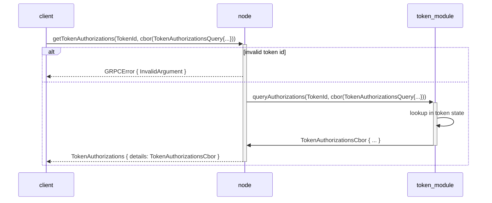
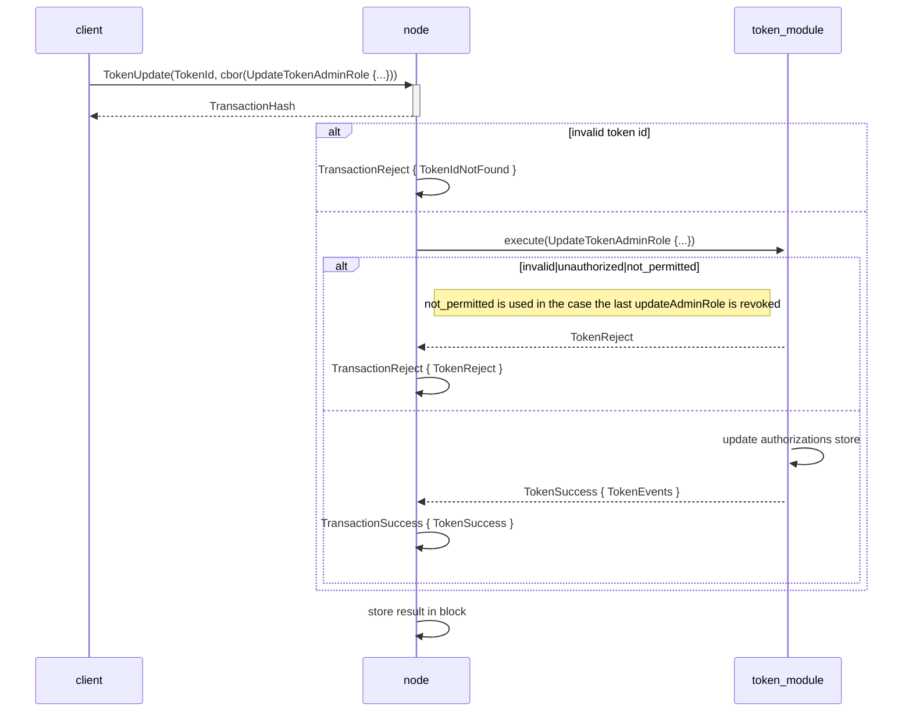
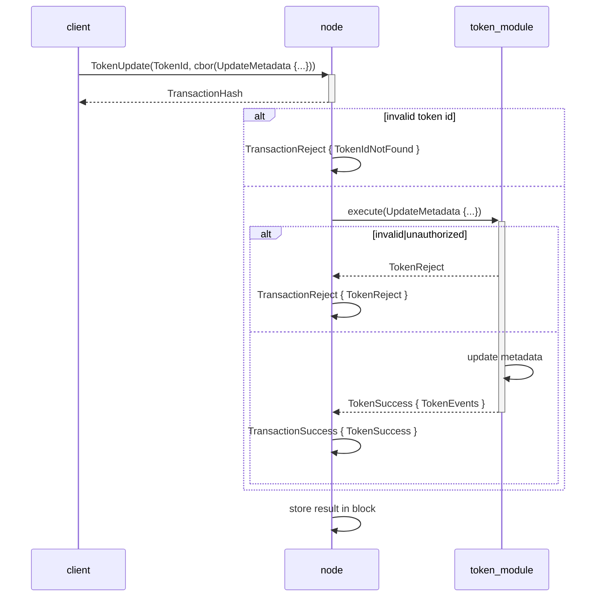

# RBAC Design specification

## [Query] `getTokenAuthorizations`

A separate query for getting token authorizations will be implemented, to not put too much
information on the more commonly used token info query.

```rust
/// The GRPC query model
struct TokenAuthorizationsQuery {
  tokenId: TokenId,
}

/// The token authorizations returned for a `TokenAuthorizationQuery`.
struct TokenAuthorizations {
  tokenId: TokenId,
  details: Cbor, // corresponding to `token-authorizations` in cddl.
}
```

```cddl
; The different The different admin roles defined for the current token module implementation.
; Each role gives access to specific administrative operations.
token-admin-role =
    ; Gives authority to perform `token-assign-admin-role` and `token-revoke-admin-role` operations.
    "updateAdminRole" /
    ; Gives authority to perform `token-mint` operations.
    "mint" /
    ; Gives authority to perform `token-burn` operations.
    "burn" /
    ; Gives authority to perform `token-add-allow-list` and `token-remove-allow-list` operations.
    "allowList" /
    ; Gives authority to perform `token-add-deny-list` and `token-remove-deny-list` operations.
    "denyList" /
    ; Gives authority to perform `token-pause` and `token-unpause` operations.
    "pause" /
    ; Gives authority to perform `token-update-metadata` operations.
    "metadata"

; Describes the authorizations structure for protocol level tokens.
token-authorizations = {
    ; A map of admin roles to the accounts that have those roles assigned.
    * token-admin-role => token-role-authorizations
}

; Authorizations details applicable to any admin role.
token-role-authorizations = {
    ; The accounts that have the role assigned.
    "accounts": [ * tagged-account-address ]
}
```



## [Operation] `UpdateAdminRole`

In practice, this is two separate operations,  `AssignAdminRole` and `RevokeAdminRole`. This follows the usual token operation flow.

```cddl
; Assign an admin role to an account.
token-assign-admin-role = {
    "assignAdminRole": token-update-admin-role-details
}

; Revoke an admin role from an account. If the account specified by the operation details
; does not have the role assigned, the transaction will fail.
token-revoke-admin-role = {
    "revokeAdminRole": token-update-admin-role-details
}

token-update-admin-role = token-assign-admin-role / token-revoke-admin-role

; The details of the `token-assign-admin-role` and `token-revoke-admin-role`
; operations.
token-update-admin-role-details = {
    ; The admin role to update.
    "role": token-admin-role,
    ; The account to update admin for.
    "account": tagged-account-address
}
```



### `token-revoke-admin-role {role: "updateRole", ...}`

## [Operation] `UpdateMetadata`

An additional operation is added to allow updating the metadata reference stored for a token. This follows the usual token operation flow.

```cddl
; Update the token metadata of a token.
token-update-metadata = {
    "updateMetadata": token-update-metadata-details
}

; The details of a `token-update-metadata` operation.
token-update-metadata-details = {
    ; A string field representing the URL
    "url": text,
    ; An optional sha256 checksum value tied to the content of the URL
    ? "checksumSha256": sha256-hash
}
```


