# Rust PLT Scheduler Component View

The diagram below depicts how the Rust PLT scheduler and the token module is embedded within the node and how it interacts with other components in the node.

The Rust PLT scheduler is responsible for executing create PLT update instructions and PLT operations (transfer, mint/burn, pause/unpause, allow/deny lists). 
The block item header (signatures, energy limit, etc.) is handled in the Haskell scheduler, only the block item payload is dispatched to the Rust PLT scheduler.
The PLT scheduler maintains circulating supply and balances. The token module maintains state related to allow/deny lists and pausing. The token module
only has access to state through the PLT kernel.

Notice that in the current implementation, the Haskell scheduler maintains the token account state (balance) by request from the Rust PLT scheduler. For simplicity, this is
not depicted in the diagram. It may change in the future, such that the Rust PLT scheduler directly maintains this account level token state.

```mermaid
C4Container
      title Rust PLT scheduler component diagram
      Container_Boundary(node, "Node (Haskell)") {
        Component(consensus, "Consensus",, "Achieves consensus on blocks in the Concordium chain.")
        Component(scheduler, "Scheduler",, "Executes block items. Checks block items headers (signature, fee charge) <br> and executes the block item payload. Is responsible for producing events, <br> reject reasons and updating block state.")
        Component(queries, "Queries",, "Queries on block state.")
        Component(block_state_comp, "BlockStateQuery/Operations (Haskell)",, "Queries on block state.")

        ComponentDb(tree_state, "Tree state (LMDB)",, "Block indexes.")
        
        Boundary(plt_scheduler_boundary, "PLT scheduler (Rust) (FFI)", "boundary") {
          Component(plt_scheduler, "PLT Scheduler",, "Executes PLT block item bodies.<br> Maintains circulating supply and balances state.")
          Component(plt_queries, "PLT Queries",, "Implements PLT queries on block state.")   
          Component(plt_block_state_comp, "BlockStateQuery/Operations (Rust)",, "Queries on block state.")

          Component(plt_kernel, "PLT Kernel",, "Executes PLT block item bodies.<br> Maintains circulating supply and balances state.")

          Boundary(token_module_boundary, "Token Module", "boundary") {
            Component(token_module, "Token Module",, "Executes create PLT instruction and PLT operations <br >and maintains module state.")
            Component(token_module_queries, "Token Module Queries",,"Implements queries on module state.")
          }       
        }     

        Boundary(block_state_boundary, "Block state (single flat file)", "boundary") {
          ComponentDb(block_state, "Block state",, "State for each block.")
          ComponentDb(plt_block_state, "PLT state",, "PLT state for each block.")  
        }
      }

Rel(consensus, tree_state, "Maintains tree state")
Rel(scheduler, block_state_comp, "Updates and queries block state")
Rel(block_state_comp, block_state, "Read/Write")
Rel(queries, block_state_comp, "Queries block state")
Rel(consensus, scheduler, "Execute block items")
Rel(queries, plt_queries, "Queries PLT state")
Rel(scheduler, plt_scheduler, "Executes PLT block item payloads")

Rel(plt_block_state_comp, plt_block_state, "Read/Write")
Rel(plt_scheduler, plt_block_state_comp, "Updates and queries block state")
Rel(plt_kernel, plt_block_state_comp, "Updates and queries block state")
Rel(plt_queries, plt_block_state_comp, "Queries block state")
Rel(plt_scheduler, token_module, "Executes PLT operations <br> and module token initialization")
Rel(plt_queries, token_module_queries, "Queries module state")
Rel(plt_block_state_comp, block_state_comp, "Query accounts by address/index<br>Query and update account token balance")

Rel(block_state, plt_block_state, "Opaque pointer")

Rel(token_module, plt_kernel, "Updates and queries")
Rel(token_module_queries, plt_kernel, "Queries")

UpdateElementStyle(consensus, $borderColor="black")
UpdateElementStyle(scheduler, $borderColor="black")
UpdateElementStyle(queries, $borderColor="black")
UpdateElementStyle(tree_state, $borderColor="black")

UpdateElementStyle(plt_scheduler, $borderColor="black")
UpdateElementStyle(plt_queries, $borderColor="black")
UpdateElementStyle(plt_kernel, $borderColor="black")

UpdateElementStyle(block_state, $borderColor="black")
UpdateElementStyle(plt_block_state, $borderColor="black")

UpdateElementStyle(token_module, $borderColor="black")
UpdateElementStyle(token_module_queries, $borderColor="black")

UpdateRelStyle(scheduler, block_state, $offsetX="-100")
UpdateRelStyle(scheduler, plt_scheduler, $lineColor="green", $textColor="green")
UpdateRelStyle(consensus, scheduler, $offsetX="-50")
UpdateRelStyle(queries, plt_queries, $lineColor="green", $textColor="green", $offsetY="-50", $offsetX="50")
UpdateRelStyle(scheduler, block_state, $offsetY="-50", $offsetX="-200")

UpdateRelStyle(plt_scheduler, token_module, $offsetY="-150", $offsetX="-180")
UpdateRelStyle(plt_scheduler, plt_block_state_comp, $offsetY="-10", $offsetX="-250")
UpdateRelStyle(plt_kernel, plt_block_state_comp, $offsetY="0", $offsetX="-220")
UpdateRelStyle(plt_block_state_comp, block_state_comp, $lineColor="red", $textColor="red", $offsetY="-10", $offsetX="-200")

UpdateRelStyle(token_module, plt_kernel, $offsetY="-30", $offsetX="0")
UpdateRelStyle(token_module_queries, plt_kernel, $offsetY="-30", $offsetX="-34")

UpdateLayoutConfig($c4ShapeInRow="4", $c4BoundaryInRow="2")
```

