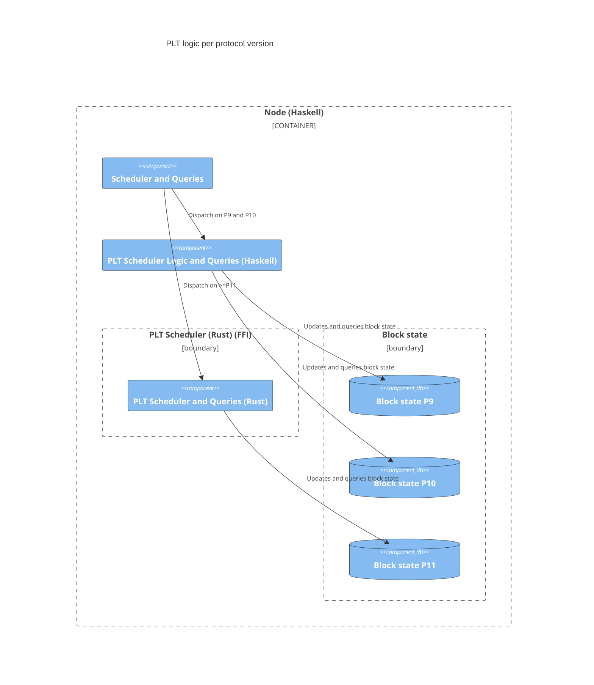

# Rust PLT Scheduler P11 Migration

The switch to use the Rust PLT Scheduler will happen at the protocol upgrade to P11. And not
at the node software update. This is to reduce risk of differences between the Rust and Haskell implementations.
The P9/10 and P11 block states will be compatible though. Long term (after the P11 migration on mainnet),
we way want to change to dispatch to the Rust PLT Scheduler also for P9 and P10 in order to clean 
up the code. We can do a catchup on mainnet using the Rust PLT scheduler, to ensure that it is compatible
with the Haskell implementation.

