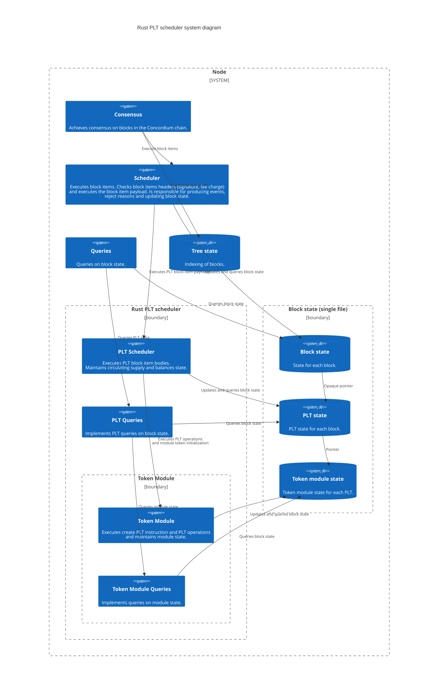

# Rust PLT Scheduler System Architecture

The diagram describes how the Rust PLT scheduler and the token module is embedded in the node and how it interacts with other components in the node.

```mermaid
C4Context
      title Rust PLT scheduler system diagram
      System_Boundary(node, "Node") {
        System(consensus, "Consensus", "Achieves consensus on blocks in the Concordium chain.")
        System(scheduler, "Scheduler", "Executes block items. Checks block items headers (signature, fee charge) <br> and executes the block item payload. Is responsible for producing events, <br> reject reasons and updating block state.")
        System(queries, "Queries", "Queries on block state.")

        Boundary(plt_scheduler_boundary, "Rust PLT scheduler", "boundary") {
          System(plt_scheduler, "PLT Scheduler", "Executes PLT block item bodies.<br> Maintains circulating supply and balances state.")
          System(plt_queries, "PLT Queries", "Implements PLT queries on block state.")   

          Boundary(token_module_boundary, "Token Module", "boundary") {
            System(token_module, "Token Module", "Executes create PLT instruction and PLT operations <br >and maintains module state.")
            System(token_module_queries, "Token Module Queries", "Implements queries on module state.")
          }       
        }     

        Boundary(block_state_boundary, "Block state (single file)", "boundary") {
          SystemDb(block_state, "Block state", "State for each block.")
          SystemDb(plt_block_state, "PLT state", "PLT state for each block.")  
          SystemDb(module_block_state, "Token module state", "Token module state for each PLT.")            
        }
        SystemDb(tree_state, "Tree state", "Indexing of blocks.")
      }

Rel(consensus, tree_state, "Maintains tree state")
Rel(scheduler, block_state, "Updates and queries block state")
Rel(queries, block_state, "Queries block state")
Rel(consensus, scheduler, "Execute block items")
Rel(plt_scheduler, plt_block_state, "Updates and queries block state")
Rel(plt_queries, plt_block_state, "Queries block state")
Rel(block_state, plt_block_state, "Opaque pointer")
Rel(plt_block_state, module_block_state, "Pointer")
Rel(queries, plt_queries, "Queries PLT state")
Rel(scheduler, plt_scheduler, "Executes PLT block item payloads")
Rel(plt_scheduler, token_module, "Executes PLT operations <br> and module token initialization")
Rel(plt_queries, token_module_queries, "Queries module state")
Rel(token_module_queries, module_block_state, "Queries block state")
Rel(token_module, module_block_state, "Updates and queries block state")

UpdateRelStyle(scheduler, block_state,  $offsetX="-100")
UpdateRelStyle(consensus, scheduler,  $offsetX="-50")
UpdateRelStyle(plt_scheduler, plt_block_state,  $offsetX="-100")
UpdateRelStyle(token_module, module_block_state,  $offsetY="20")

UpdateLayoutConfig($c4ShapeInRow="3", $c4BoundaryInRow="2")
```